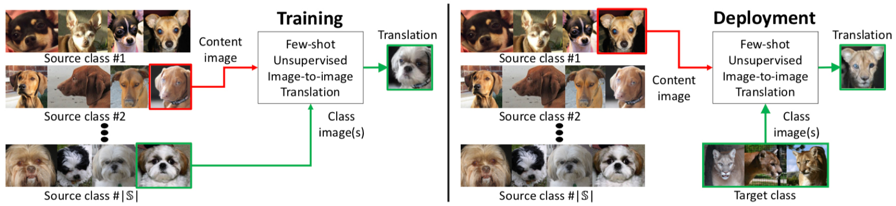
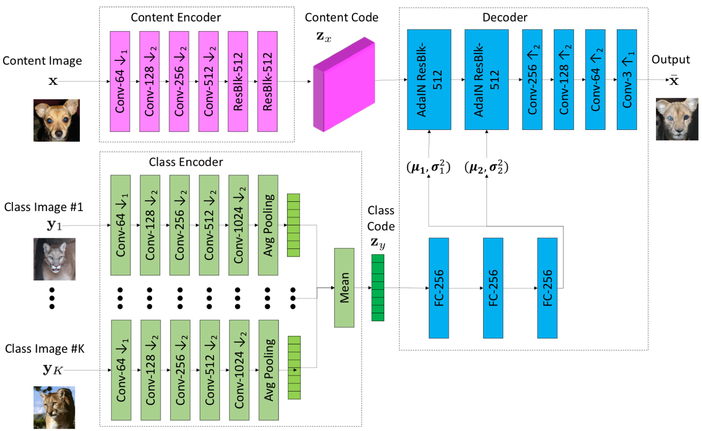
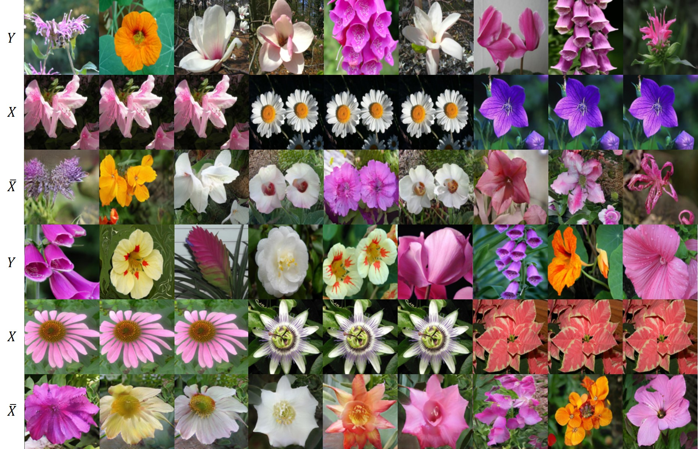
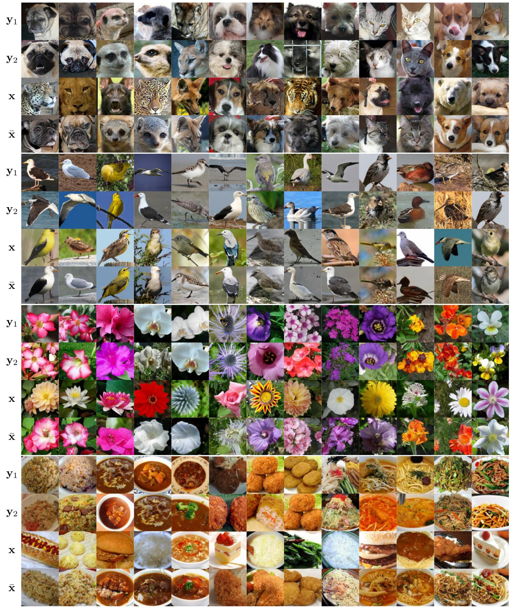

# FUNIT-pytorch
## : Few-Shot Unsupervised Image-to-Image Translation (ICCV 2019)

<div align="center">
 
 
</div>

### [Paper](https://arxiv.org/abs/1905.01723) | [Official PyTorch code](https://github.com/NVlabs/FUNIT)

## Tensorflow Implementation
[Tensorflow Implementation](https://github.com/taki0112/FUNIT-Tensorflow)

## Usage
```
├── dataset
   └── YOUR_DATASET_NAME
       ├── train
           ├── class1 (class folder)
               ├── xxx.jpg (class1 image)
               ├── yyy.png
               ├── ...
           ├── class2
               ├── aaa.jpg (class2 image)
               ├── bbb.png
               ├── ...
           ├── class3
           ├── ...
       ├── test
           ├── class1
               ├── zzz.jpg (class1 image)
               ├── www.png
               ├── ...
           ├── class2
               ├── ccc.jpg (class2 image)
               ├── ddd.jpg
               ├── ...
```

### Train
```
> python main.py --dataset flower
```

### Test
```
> python main.py --dataset flower --phase test --K 1
```

## Architecture


## Our result


## Paper result

